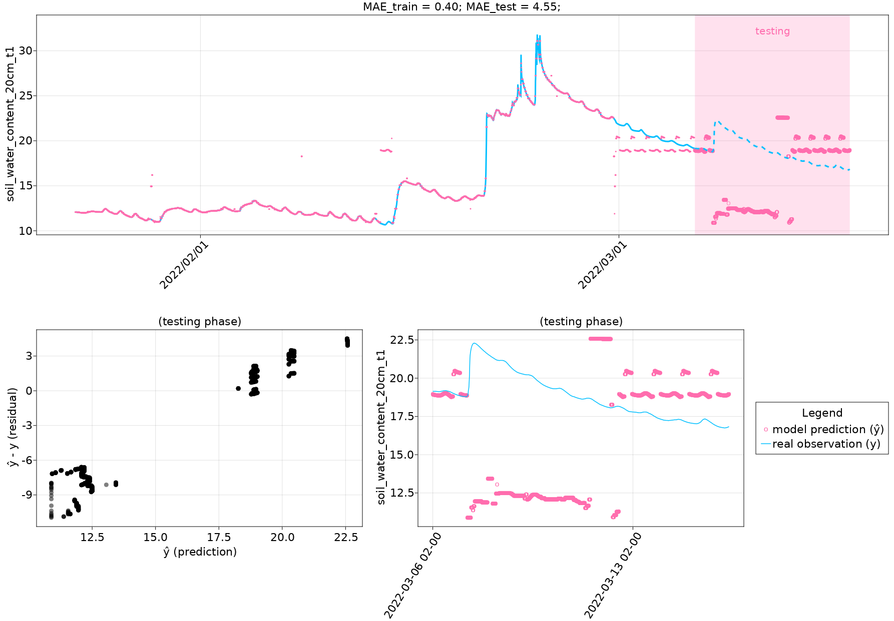
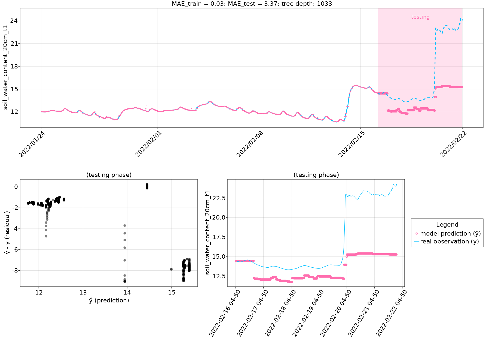
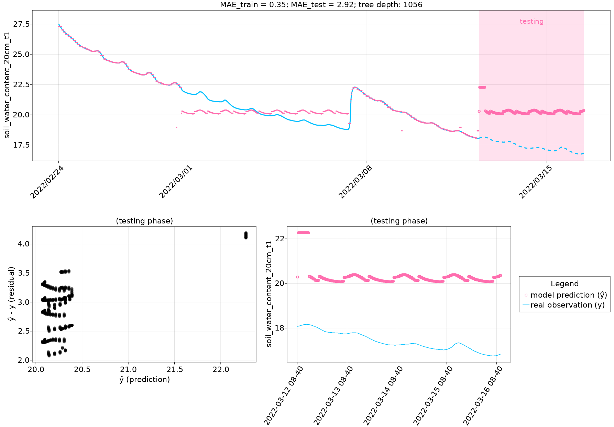
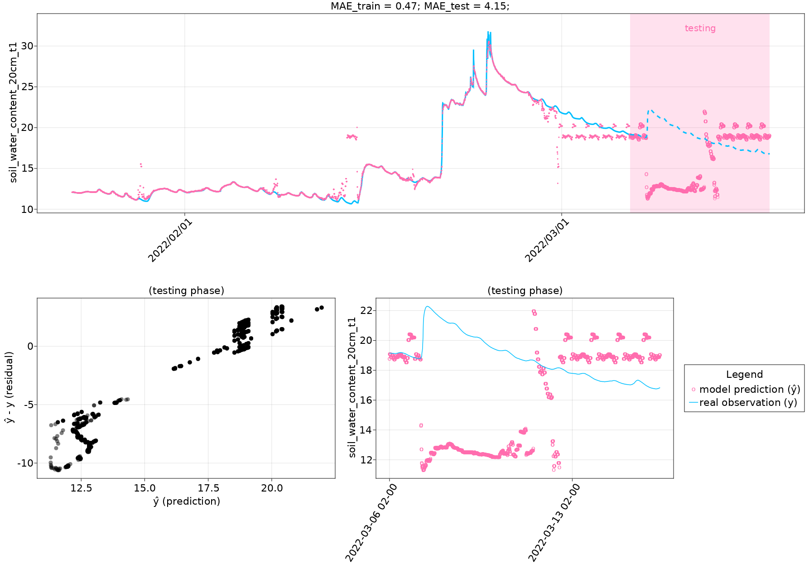
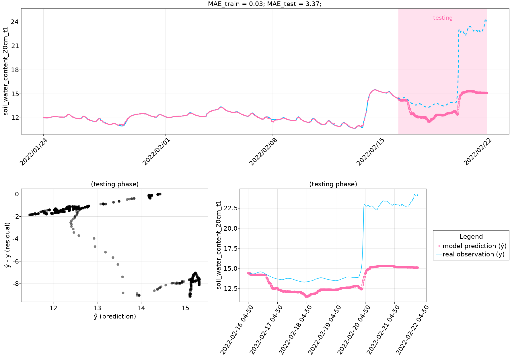
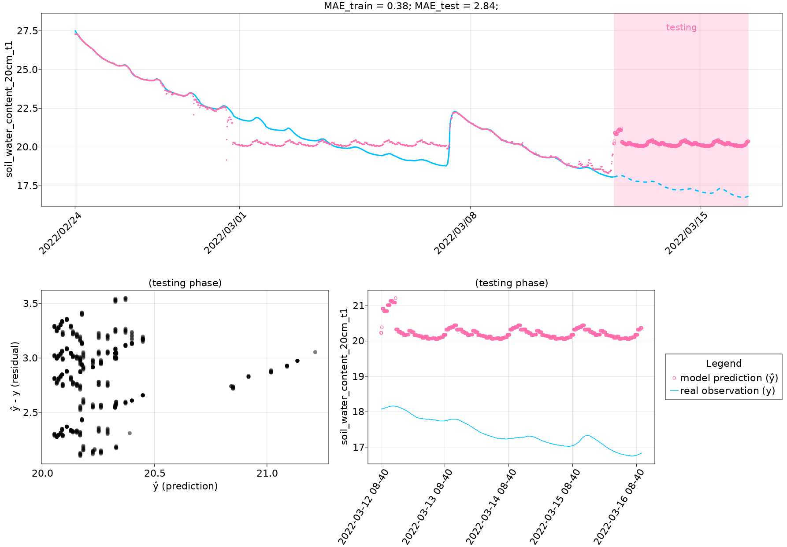

class: center, middle
background-image: url(assets/img/bg_watercolorblue.jpg)

# 以決策樹演算法估計土壤水含量
基於農試所的資料、以決策樹演算法進行土壤水含量之估計(2022-06-02)；
本測試之模型訓練與驗證與5頁期中報告之方法大致相同；細節詳見投影片。

This slide presents our preliminary results of predicting soil water content (SWC) using the decision tree algorithm (regression tree).

---

### 資料期間
本測試使用臺中農試所水文觀測的資料，資料期間為 2022-01-18 至 2022-03-16。
受限於手上的資料，本測試僅使用以下變數進行模型訓練與驗證。
- 時間(小時)
- 降雨量(精度應為5mm)以及降雨量的衍伸量(累積雨量)

### 訓練與預測期
資料被劃分為以下三個區間，分別進行1.決策樹 2.隨機森林的模型訓練與驗證：
- **所有資料**：2022-01-22 至 2022-03-16
- **一至二月**：2022-01-22 至 2022-02-22
- **二至三月**：2022-02-22 至 2022-03-16

> 由於需計算3日累積雨量，再加上資料往前最多會平移288個資料點(288×10mins=2days)，故後續圖片不會顯示1/18至1/23的資料。

---

class: left, middle
# One Tree

---

## Description

### Hyperparameters

#### Resampling

  * `TimeSeriesCV` is applied with 12 folds.

#### Partitioning

80.0% of data is applied for training and validation, and 20.0% of data is for testing.

#### Data shift

The past ($t_i, i=0, -2, -4, -6, -12, -18, -24, -48, -72, -144, -288$) data are applied for predicting the future ($t_j, j=1$) SWC.

---

## Description

### Features (best model)

For training:

  * hour ($t_i, i=0$; total 1 variables)
  * precipitation 05mm ($t_i, i=-288,-144,...,0$; total 11 variables)
  * precipitation 05mm 12hour ($t_i, i=-288,-144,...,0$; total 11 variables)
  * precipitation 05mm 1day ($t_i, i=-288,-144,...,0$; total 11 variables)
  * precipitation 05mm 1hour ($t_i, i=-288,-144,...,0$; total 11 variables)
  * precipitation 05mm 2day ($t_i, i=-288,-144,...,0$; total 11 variables)
  * precipitation 05mm 3day ($t_i, i=-288,-144,...,0$; total 11 variables)

To Predict:

  * `"soil_water_content_20cm_t1"`

---

# Result (7aa4)

---

# Result (5a40)

---

# Result (3109)

---

class: left, middle
# Random Forest

---

## Description

### Hyperparameters

#### Resampling

  * `TimeSeriesCV` is applied with 12 folds.

#### Partitioning

80.0% of data is applied for training and validation, and 20.0% of data is for testing.

#### Data shift

The past ($t_i, i=0, -2, -4, -6, -12, -18, -24, -48, -72, -144, -288$) data are applied for predicting the future ($t_j, j=1$) SWC.

---

## Description

### Features (best model)

For training:

  * hour ($t_i, i=0$; total 1 variables)
  * precipitation 05mm ($t_i, i=-288,-144,...,0$; total 11 variables)
  * precipitation 05mm 12hour ($t_i, i=-288,-144,...,0$; total 11 variables)
  * precipitation 05mm 1day ($t_i, i=-288,-144,...,0$; total 11 variables)
  * precipitation 05mm 1hour ($t_i, i=-288,-144,...,0$; total 11 variables)
  * precipitation 05mm 2day ($t_i, i=-288,-144,...,0$; total 11 variables)
  * precipitation 05mm 3day ($t_i, i=-288,-144,...,0$; total 11 variables)

To Predict:

  * `"soil_water_content_20cm_t1"`

---

# Result (a835)

---

# Result (fdc4)

---

# Result (742b)

---
class: left, middle
# Appendix

---

### Model Summary (7aa4)

Decision Tree 

  * Leaves: 411
  * Depth:  19

---

### Model Summary (5a40)

Decision Tree 

  * Leaves: 256
  * Depth:  14

---

### Model Summary (3109)

Decision Tree 

  * Leaves: 132
  * Depth:  13

---

### Model Summary (a835)

Ensemble of Decision Trees 

  * Trees:      50
  * Avg Leaves: 290.62
  * Avg Depth:  18.66

---

### Model Summary (fdc4)

Ensemble of Decision Trees 

  * Trees:      50
  * Avg Leaves: 172.4
  * Avg Depth:  15.44

---

### Model Summary (742b)

Ensemble of Decision Trees 

  * Trees:      50
  * Avg Leaves: 96.66
  * Avg Depth:  16.82

---

*This page was generated using [Literate.jl](https://github.com/fredrikekre/Literate.jl).*

